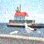

 <table border="1">
  <tr>
  <td>task</td><td>paint</td><td>noise</td><td>gaussian</td><td>mosaic</td>
  </tr><tr>
  <td>original</td><td></td><td></td><td></td><td></td>
  </tr><tr>
  <td>not conditional</td><td></td><td></td><td></td><td></td>
  </tr><tr>
  <td>conditional</td><td></td><td></td><td></td><td></td>
  </tr>
 </table>